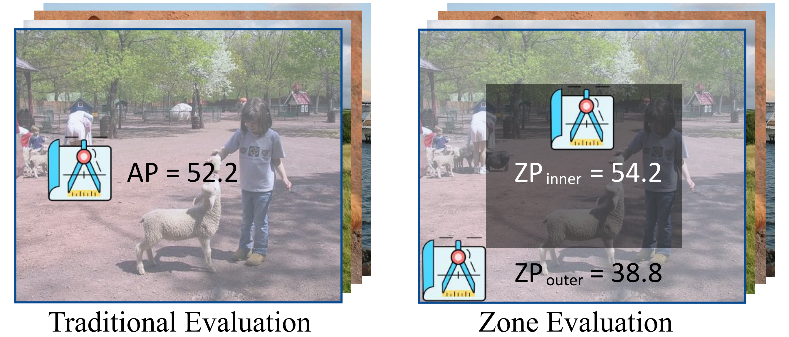

## Zone Evaluation: Revealing Spatial Bias in Object Detection

<div align="center"></div>

### This is the source codes of our [paper](https://arxiv.org/abs/2310.13215). We provide zone evaluation on [MMDetection v2.25.3](mmdetection), [YOLOv5](yolov5), and [YOLOv8](yolov8).

### Here is a detailed step-by-step [tutorial](tutorials/readme.md).

```
@article{zheng2023ZoneEval,
  title={Zone Evaluation: Revealing Spatial Bias in Object Detection},
  author= {Zheng, Zhaohui and Chen, Yuming and Hou, Qibin and Li, Xiang and Wang, Ping and Cheng, Ming-Ming},
  journal={arXiv preprint arXiv:2310.13215},
  year={2023}
}
```

## Introduction

A fundamental limitation of object detectors is that they suffer from ``spatial bias'', and in particular perform less satisfactorily when detecting objects near image borders.
For a long time, there has been a lack of effective ways to measure and identify spatial bias, and little is known about where it comes from and what degree it is.
To this end, we present a new zone evaluation protocol, extending from the traditional evaluation to a more generalized one, which measures the detection performance over zones, yielding a series of Zone Precisions (ZPs).
For the first time, we provide numerical results, showing that the object detectors perform quite unevenly across the zones.
Surprisingly, the detector's performance in the 96% border zone of the image does not reach the AP value (Average Precision, commonly regarded as the average detection performance in the entire image zone).
To better understand spatial bias, a series of heuristic experiments are conducted.
Our investigation excludes two intuitive conjectures about spatial bias that the object scale and the absolute positions of objects barely influence the spatial bias.
We find that the key lies in the human-imperceptible divergence in data patterns between objects in different zones, thus eventually forming a visible performance gap between the zones.
With these findings, we finally discuss a future direction for object detection, namely, spatial disequilibrium problem, aiming at pursuing a balanced detection ability over the entire image zone.
By broadly evaluating 10 popular object detectors and 5 detection datasets, we shed light on the spatial bias of object detectors.
We hope this work could raise a focus on detection robustness.

## Installation

```
conda create --name ZoneEval python=3.8 -y

conda activate ZoneEval

conda install pytorch=1.12 cudatoolkit=11.3 torchvision=0.13.0 -c pytorch

pip install mmcv-full==1.6.0 -f https://download.openmmlab.com/mmcv/dist/cu113/torch1.12.0/index.html

git clone https://github.com/Zzh-tju/ZoneEval.git

cd ZoneEval/pycocotools

pip install -e .

cd ..

cd mmdetection

pip install -v -e .
```

## Dataset Preparations

Please refer to [Dataset Preparations](https://github.com/Zzh-tju/ZoneEval/blob/main/tutorials/dataset_preparation.md) for preparing PASCAL VOC 07+12, Face Mask, Fruit, Helmet, and MS COCO datasets.

## Evaluation

### Turn on zone evaluation

The relevant options can be specified on the config file,

```
model = dict(
    test_cfg=dict(zone_eval=True))   # set to False and evaluate in the conventional way.
```

### Evaluation command

```
# for VOC and 3 application datasets

./tools/dist_test.sh configs/sela/your_config_file.py your_model.pth 2 --eval mAP

# for MS COCO

./tools/dist_test.sh configs/sela/your_config_file.py your_model.pth 2 --eval bbox
```

Currently, we provide evaluation for various object detectors, and the pretrained weight file can be downloaded from MMDetection or their official websites.

| Detector | Network & TS  | $\text{ZP}^{0,5}$| Var | $\text{ZP}^{0,1}$ | $\text{ZP}^{1,2}$ | $\text{ZP}^{2,3}$ | $\text{ZP}^{3,4}$ | $\text{ZP}^{4,5}$ | FPS |
|----------|:--------:|:--------:|:--------:|:--------:|:--------:|:--------:|:--------:|:--------:|:--------:|
|[RetinaNet](mmdetection/configs/others/retinanet/retinanet_r50_fpn_1x_coco.py) | [R50_1x](https://download.openmmlab.com/mmdetection/v2.0/retinanet/retinanet_r50_fpn_1x_coco/retinanet_r50_fpn_1x_coco_20200130-c2398f9e.pth)  | 36.5 | 14.8 | 27.3 | 33.3 | 35.5 | 34.5 | 39.2 | 35.4 |
|[RetinaNet](mmdetection/configs/others/retinanet/retinanet_r50_fpn_1x_coco.py) | [R50_2x](https://download.openmmlab.com/mmdetection/v2.0/retinanet/retinanet_r50_fpn_2x_coco/retinanet_r50_fpn_2x_coco_20200131-fdb43119.pth)  | 37.4 | 16.9 | 27.6 | 34.6 | 35.8 | 35.1 | 40.4 | 35.4 |
|[Faster R-CNN](mmdetection/configs/others/faster_rcnn/faster_rcnn_r50_fpn_1x_coco.py) | [R50_1x](https://download.openmmlab.com/mmdetection/v2.0/faster_rcnn/faster_rcnn_r50_fpn_1x_coco/faster_rcnn_r50_fpn_1x_coco_20200130-047c8118.pth)  | 37.4 | 11.8 | 29.3 | 34.2 | 36.1 | 35.0 | 39.9 | 37.5 |
|[YOLOF](mmdetection/configs/others/yolof/yolof_r50_c5_8x8_1x_coco.py) | [R50_1x](https://download.openmmlab.com/mmdetection/v2.0/yolof/yolof_r50_c5_8x8_1x_coco/yolof_r50_c5_8x8_1x_coco_20210425_024427-8e864411.pth)  | 37.5 | 12.8 | 28.4 | 35.2 | 36.6 | 35.3 | 39.2 | 61.6 |
|[Sparse R-CNN](mmdetection/configs/others/sparse_rcnn/sparse_rcnn_r50_fpn_1x_coco.py) | [R50_1x](https://download.openmmlab.com/mmdetection/v2.0/sparse_rcnn/sparse_rcnn_r50_fpn_1x_coco/sparse_rcnn_r50_fpn_1x_coco_20201222_214453-dc79b137.pth)  | 37.9 | 22.8 | 27.8 | 34.7 | 37.1 | 37.1 | 42.6 | 37.8 |
|[YOLOv5-s](https://github.com/ultralytics/yolov5) |  | 37.4 | 10.5 | 28.8 | 34.9 | 36.9 | 35.1 | 38.4 | 140.0 |
|[RepPoints](mmdetection/configs/others/reppoints/reppoints_moment_r50_fpn_gn-neck+head_1x_coco.py) | [R50_1x](https://download.openmmlab.com/mmdetection/v2.0/reppoints/reppoints_moment_r50_fpn_gn-neck%2Bhead_1x_coco/reppoints_moment_r50_fpn_gn-neck%2Bhead_1x_coco_20200329_145952-3e51b550.pth)  | 38.1 | 12.9 | 29.2 | 34.7 | 36.7 | 35.6 | 40.3 | 27.4 |
|[FCOS](mmdetection/configs/others/fcos/fcos_center-normbbox-centeronreg-giou_r50_caffe_fpn_gn-head_1x_coco.py) | [R50_1x](https://download.openmmlab.com/mmdetection/v2.0/fcos/fcos_center-normbbox-centeronreg-giou_r50_caffe_fpn_gn-head_1x_coco/fcos_center-normbbox-centeronreg-giou_r50_caffe_fpn_gn-head_1x_coco-0a0d75a8.pth)  | 38.7 | 14.7 | 29.5 | 35.3 | 38.0 | 36.7 | 41.1 | 37.3 |
| |
|[DETR](mmdetection/configs/others/detr/detr_r50_8x2_150e_coco.py) | [R50_150e](https://download.openmmlab.com/mmdetection/v2.0/detr/detr_r50_8x2_150e_coco/detr_r50_8x2_150e_coco_20201130_194835-2c4b8974.pth)  | 40.1 | 26.9 | 29.8 | 36.2 | 39.8 | 39.1 | 45.7 | 49.9 |
|[RetinaNet](mmdetection/configs/others/pvt/retinanet_pvt-s_fpn_1x_coco.py) | [PVT-s_1x](https://download.openmmlab.com/mmdetection/v2.0/pvt/retinanet_pvt-s_fpn_1x_coco/retinanet_pvt-s_fpn_1x_coco_20210906_142921-b6c94a5b.pth)  | 40.4 | 19.7 | 30.8 | 36.9 | 39.0 | 37.4 | 44.6 | 20.0 |
[Cascade R-CNN](mmdetection/configs/others/cascade_rcnn/cascade_rcnn_r50_fpn_1x_coco.py) | [R50_1x](https://download.openmmlab.com/mmdetection/v2.0/cascade_rcnn/cascade_rcnn_r50_fpn_1x_coco/cascade_rcnn_r50_fpn_1x_coco_20200316-3dc56deb.pth)  | 40.3 | 18.7 | 30.9 | 36.6 | 39.2 | 38.6 | 44.2 | 30.7 |
|[GFocal](mmdetection/configs/sela/gfl_r50_fpn_1x_coco.py) | [R50_1x](https://drive.google.com/file/d/1c5DCfs7r0iICydy2SiWQMIte_Nf4D1dy/view?usp=share_link)  | 40.1 | 16.9 | 31.1 | 37.5 | 39.4 | 38.5 | 43.8 | 37.2 |
| |
|[YOLOv8-s](https://github.com/ultralytics/ultralytics) |  | 44.9 | 24.4 | 33.4 | 42.2 | 44.3 | 43.2 | 48.5 | 128.5 |
|[Cascade Mask R-CNN](mmdetection/configs/others/cascade_rcnn/cascade_mask_rcnn_r101_caffe_fpn_mstrain_3x_coco.py) | [R101_3x](https://download.openmmlab.com/mmdetection/v2.0/cascade_rcnn/cascade_mask_rcnn_r101_caffe_fpn_mstrain_3x_coco/cascade_mask_rcnn_r101_caffe_fpn_mstrain_3x_coco_20210707_002620-a5bd2389.pth)  | 45.4 | 22.4 | 34.7 | 41.6 | 44.3 | 44.4 | 49.1 | 18.7 |
|[Sparse R-CNN](mmdetection/configs/others/sparse_rcnn/sparse_rcnn_r50_fpn_300_proposals_crop_mstrain_480-800_3x_coco.py) | [R50_3x](https://download.openmmlab.com/mmdetection/v2.0/sparse_rcnn/sparse_rcnn_r50_fpn_300_proposals_crop_mstrain_480-800_3x_coco/sparse_rcnn_r50_fpn_300_proposals_crop_mstrain_480-800_3x_coco_20201223_024605-9fe92701.pth)  | 45.0 | 21.6 | 35.8 | 41.9 | 43.4 | 44.0 | 50.3 | 32.1 |
|[YOLOv5-m](https://github.com/ultralytics/yolov5) |  | 45.2 | 12.9 | 36.0 | 42.3 | 44.5 | 43.2 | 46.7 | 104.6 |
| |
[Mask R-CNN](mmdetection/configs/others/swin/mask_rcnn_swin-t-p4-w7_fpn_ms-crop-3x_coco.py ) | [Swin-T_3x](https://download.openmmlab.com/mmdetection/v2.0/swin/mask_rcnn_swin-t-p4-w7_fpn_ms-crop-3x_coco/mask_rcnn_swin-t-p4-w7_fpn_ms-crop-3x_coco_20210906_131725-bacf6f7b.pth)  | 46.0 | 15.4 | 36.8 | 41.7 | 44.1 | 43.5 | 49.0 | 24.3 |
|[Mask R-CNN](mmdetection/configs/others/convnext/mask_rcnn_convnext-t_p4_w7_fpn_fp16_ms-crop_3x_coco.py) | [ConvNeXt-T_3x](https://download.openmmlab.com/mmdetection/v2.0/convnext/mask_rcnn_convnext-t_p4_w7_fpn_fp16_ms-crop_3x_coco/mask_rcnn_convnext-t_p4_w7_fpn_fp16_ms-crop_3x_coco_20220426_154953-050731f4.pth)  | 46.2 | 17.6 | 36.7 | 41.9 | 44.5 | 43.6 | 49.7 | 22.6 |
|[Cascade Mask R-CNN](mmdetection/configs/others/cascade_rcnn/cascade_mask_rcnn_x101_32x8d_fpn_mstrain_3x_coco.py) | [X101-32x8d_3x](https://download.openmmlab.com/mmdetection/v2.0/cascade_rcnn/cascade_mask_rcnn_x101_32x8d_fpn_mstrain_3x_coco/cascade_mask_rcnn_x101_32x8d_fpn_mstrain_3x_coco_20210719_180640-9ff7e76f.pth)  | 46.1 | 21.1 | 36.1 | 42.0 | 44.8 | 45.9 | 49.9 | 13.5 |
|[VFNet](mmdetection/configs/others/vfnet/vfnet_r101_fpn_mstrain_2x_coco.py) | [R101_2x](https://download.openmmlab.com/mmdetection/v2.0/vfnet/vfnet_r101_fpn_mstrain_2x_coco/vfnet_r101_fpn_mstrain_2x_coco_20201027pth-4a5d53f1.pth)  | 46.2 | 15.6 | 36.7 | 43.0 | 45.0 | 44.5 | 48.8 | 25.9 |
|[Deformable DETR](mmdetection/configs/others/deformable_detr/deformable_detr_refine_r50_16x2_50e_coco.py) | [R50_50e](https://download.openmmlab.com/mmdetection/v2.0/deformable_detr/deformable_detr_refine_r50_16x2_50e_coco/deformable_detr_refine_r50_16x2_50e_coco_20210419_220503-5f5dff21.pth)  | 46.1 | 23.2 | 36.3 | 42.6 | 45.6 | 45.1 | 51.2 | 25.9 |
|[Sparse R-CNN](mmdetection/configs/others/sparse_rcnn/sparse_rcnn_r101_fpn_300_proposals_crop_mstrain_480-800_3x_coco.py) | [R101_3x](https://download.openmmlab.com/mmdetection/v2.0/sparse_rcnn/sparse_rcnn_r101_fpn_300_proposals_crop_mstrain_480-800_3x_coco/sparse_rcnn_r101_fpn_300_proposals_crop_mstrain_480-800_3x_coco_20201223_023452-c23c3564.pth)  | 46.2 | 21.1 | 36.9 | 42.9 | 44.9 | 44.7 | 51.3 | 25.2 |
|[GFocal](mmdetection/configs/others/gfl/gfl_x101_32x4d_fpn_mstrain_2x_coco.py) | [X101-32x4d_2x](https://download.openmmlab.com/mmdetection/v2.0/gfl/gfl_x101_32x4d_fpn_mstrain_2x_coco/gfl_x101_32x4d_fpn_mstrain_2x_coco_20200630_102002-50c1ffdb.pth) | 46.1 | 15.7 | 37.0 | 43.5 | 45.0 | 44.4 | 49.3 | 25.2 |

#### Note: 
 - '**TS**': Training Schedule. 
 - ' $\text{ZP}^{0,5}$ ': the traditional Average Precision.
 - '**Var**': the variance of the 5 ZP ( $\text{ZP}^{0,1}$, $\text{ZP}^{1,2}$, ..., $\text{ZP}^{4,5}$ ).
 - '**FPS**' is measured on a single RTX 3090 GPU. Class score threshold=0.05, NMS IoU threshold=0.6. The test resolution is 640 for YOLOv5 and YOLOv8, while [1333, 800] for the others.
 - If you test DETR series, you must modify the `simple_test()` function in `mmdet/models/detectors/single_stage.py`,

```python
        #outs = self.bbox_head(feat)
        outs = self.bbox_head(feat, img_metas) # if you test DETR series
```

Currently, we do not support zone evaluation for instance segmentation models.

