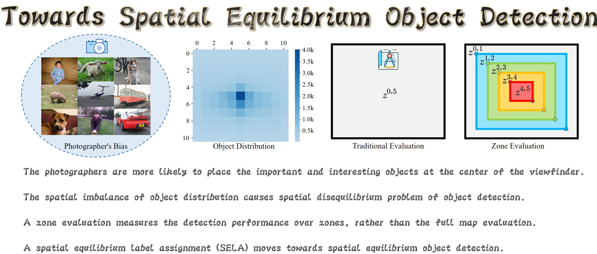
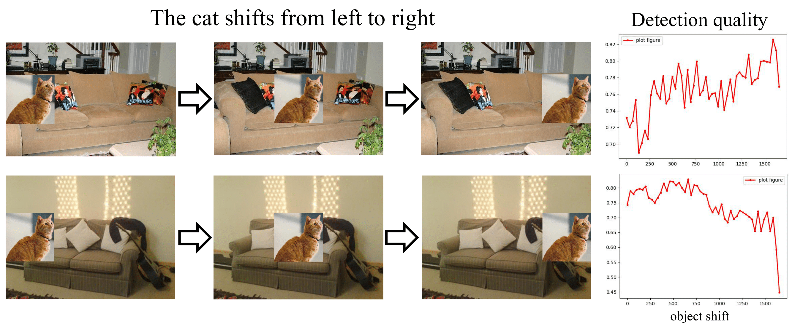
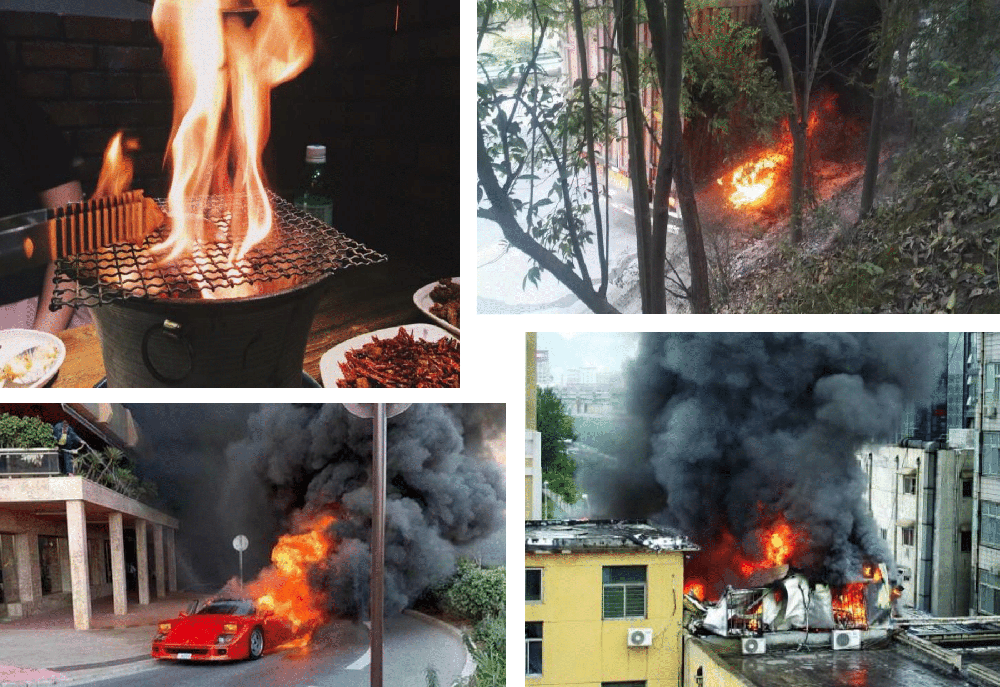
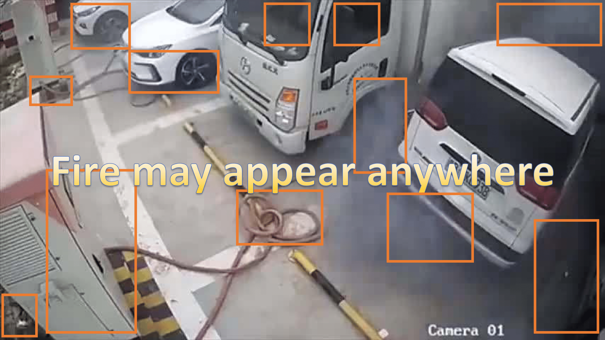
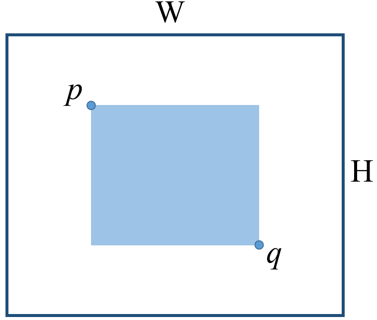

# Why does spatial equilibrium matter?

### The detector cannot perform uniformly across the zones.

### The detection performance is correlated with the object distribution.

When the object distribution satisfies the centralized photographer’s bias, the detector will favor more to the central zone, while losing the performance in most areas outside.

### This is not good for robust detection application.

If you have a fire dataset like this, the detector will be good at detecting fire in the central zone of the image. But for the zone near to the image border, uh huh, hope you are safe.

## Zone Evaluation

Let’s start by the definition of evaluation zones. We define a rectangle region $R_i=\text{Rectangle}(p,q)=\text{Rectangle}((r_iW,r_iH),((1-r_i)W,(1-r_i)H))$ like this, 

where $i\in$ { $0,1,\cdots,n$ }, $n$ is the number of zones.

Then, the evaluation zones are disigned to be a series of annular zone $z_i^j=R_i\setminus R_j$.
We denote the range of the annular zone $z_i^j$ as $(r_i,r_j)$ for brevity.

We measure the detection performance for a specific zone $z_i^j$ by only considering the ground-truth objects and the detections whose centers lie in the zone $z_i^j$.
Then, for an arbitrary evaluation metric $m$, for instance Average Precision (AP), the evaluation process stays the same to the conventional ways, yielding Zone Precision (ZP), denoted by ZP@$z_i^j$.
