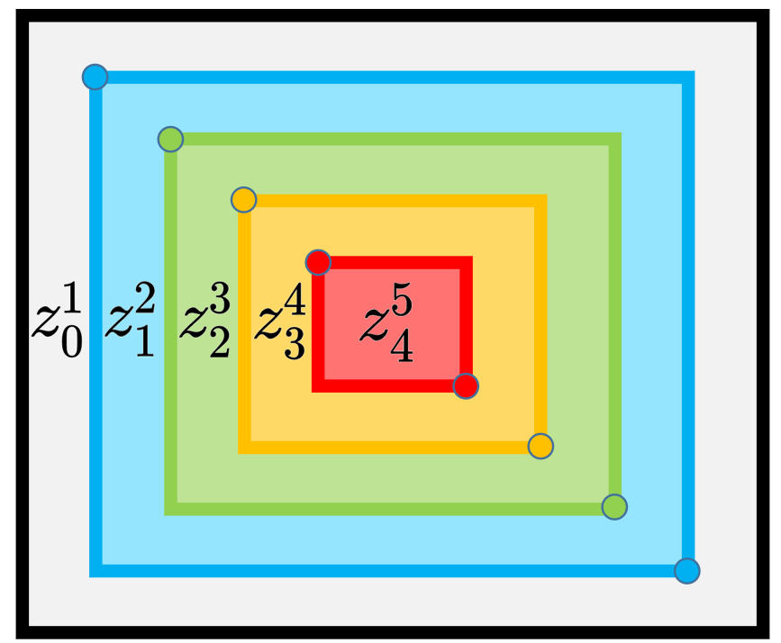
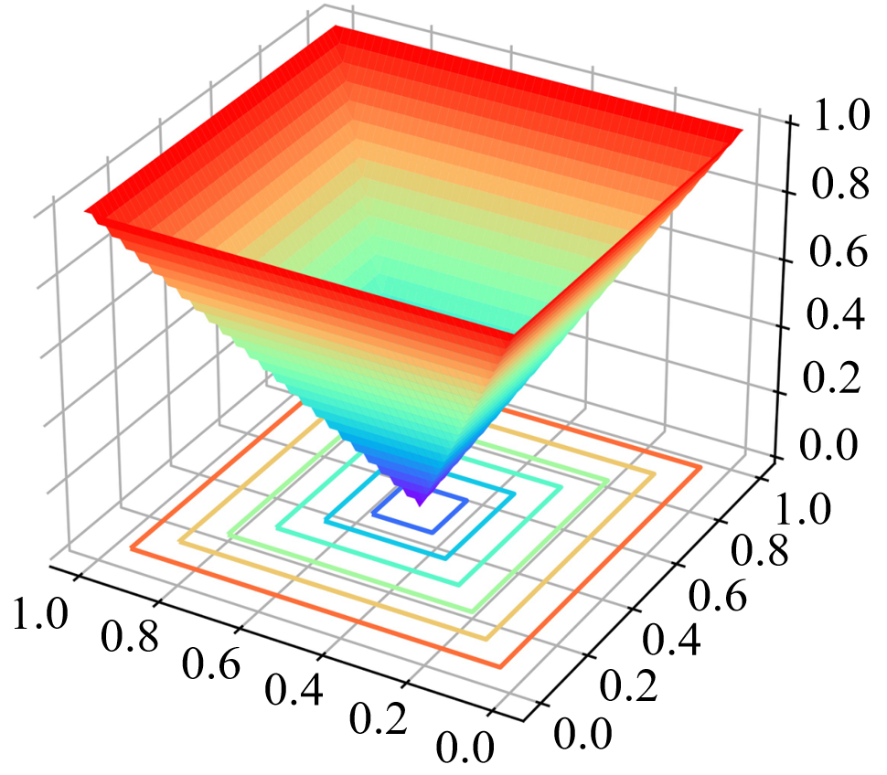

# Why does spatial equilibrium matter?

### The detector cannot perform uniformly across the zones.

### The detection performance is correlated with the object distribution.

When the object distribution satisfies the centralized photographer’s bias, the detector will favor more to the central zone, while losing the performance in most areas outside.

### This is not good for robust detection application.

If you have a fire dataset like this, the detector will be good at detecting fire in the central zone of the image. But for the zone near to the image border, uh huh, hope you are safe.

## Zone Evaluation

### Zone Precision

Let’s start by the definition of evaluation zones. We define a rectangle region $R_i=\text{Rectangle}(p,q)=\text{Rectangle}((r_iW,r_iH),((1-r_i)W,(1-r_i)H))$ like this, 

where $i\in$ { $0,1,\cdots,n$ }, $n$ is the number of zones.

Then, the evaluation zones are disigned to be a series of annular zone $z_i^j=R_i\setminus R_j$, $i\textless j$.
We denote the range of the annular zone $z_i^j$ as $(r_i,r_j)$ for brevity.

We measure the detection performance for a specific zone $z_i^j$ by only considering the ground-truth objects and the detections whose centers lie in the zone $z_i^j$.
Then, for an arbitrary evaluation metric, for instance Average Precision (AP), the evaluation process stays the same to the conventional ways, yielding Zone Precision (ZP), denoted by ZP@ $z_i^j$. Consider the default setting $n=5$, the evaluation zones look like this,

For implementation, please refer to [Zone evaluation](implementation.md).

### Spatial Equilibrium Precision

Now that we have 5 ZPs, and they indeed provide more information about the detector's performance. We further present a **S**patial equilibrium **P**recision (SP), and we use this single value to characterize the detection performance for convenient usage.

 $\mathrm{SP}=\sum\limits_{i=0}^{n-1}\mathrm{Area}(z_i^{i+1})\mathrm{ZP}\text{@}z_i^{i+1}$ 

where $\mathrm{Area}(z_i^{i+1})$ calculates the area of the zone $z_i^{i+1}$ in the normalized image space (square image with unit area 1). In general, SP is a weighted sum of the 5 ZPs, that is,
 

 $\mathrm{SP}=0.36\mathrm{ZP}\text{@}z_0^1+0.28\mathrm{ZP}\text{@}z_1^2+0.20\mathrm{ZP}\text{@}z_2^3+0.12\mathrm{ZP}\text{@}z_3^4+0.04\mathrm{ZP}\text{@}z_4^5$ 

Our SP is based on the assumption similar to the traditional AP, i.e., the detector performs uniformly in the zone.
The difference is, our SP applies this assumption to a series of smaller zones, rather than the full map for traditional AP.
One can see that when $n=1$, our SP is identical to traditional AP as the term $\mathrm{Area}(z_i^j)=1$, which means that the detectors are assumed to perform uniformly in the whole image zone.
As $n$ increases, the requirements for spatial equilibrium become stricter and stricter. And a large $n>5$ is also acceptable if a more rigorous spatial equilibrium is required.

### Variance of ZPs

As the detection performance varies across the zones, we further introduce an additional metric to gauge the discrete amplitude among the zone metrics.
Given all the ZPs, we calculate the variance of ZPs,

$\sigma(\mathrm{ZP}) = \sum\limits_{i=0}^{n-1}(\mathrm{ZP}\text{@}z_i^{i+1}-\bar{\mathrm{ZP}})^2/n,$

where $\bar{\mathrm{ZP}}$ is the mean value of ZPs.
Ideally, if $\sigma(\mathrm{ZP})=0$, the object detector reaches perfectly spatial equilibrium under the current zone division.
In this situation, an object can be well detected without being influenced by its spatial position.

## Spatial Equilibrium Label Assignment (SELA)

As a preliminary attempt, SELA utilizes a prior spatial weight to re-balance the sampling process during model training.
We map the anchor point coordinate $(x^a, y^a)$ to a spatial weight $\alpha(x^a, y^a)$ by a spatial weighting function,

 $\alpha(x,y) = 2\max\left\{||x-\frac{W}{2}||_1\frac{1}{W}, ||y-\frac{H}{2}||_1\frac{1}{H}\right\},$ 

Obviously, the spatial weight has the following properties:

(1) Non-negativity; (2) Bounded by $[0,1]$; (3) $\lim\limits_{(x,y)\rightarrow (\frac{W}{2},\frac{H}{2})}\alpha(x,y)=0$; and (4) When $p$ is located at the image border, $\lim\limits_{(x,y)\rightarrow p}\alpha(x,y)\rightarrow 1$.

The usage of spatial weight is multi-optional. We now provide two implementations. One is frequency-based approach, and another is cost-sensitive learning approach.

### SELA (frequency-based)

The frequency-based approach is straightforward. 
We know that the fixed label assignment strategy, e.g., the max-IoU assigner, is popular for years.
Given the positive IoU threshold $t$, the max-IoU assigner determines the positive samples by,

 $\textrm{IoU}(B^{a},B^{gt})\geqslant t,$ 

where $B^{a}$ and $B^{gt}$ denote the preset anchor boxes and the ground-truth boxes.
In RetinaNet and RPN, $t=0.5$ is a constant.
In [ATSS](https://arxiv.org/abs/1912.02424), the assignment follows the same rule except the calculation of the IoU threshold.

Our SELA is simple that we just need to take one more factor into account, i.e., the spatial weight.

 $\textrm{IoU}(B^a,B^{gt})\geqslant t-\gamma\alpha(x^{a},y^{a}),$ 

where $\gamma\geqslant 0$ is a hyper-parameter.
Now you see SELA relaxes the positive sample selection conditions for objects in the boundary zone.
Therefore, more anchor points will be selected as the positive samples for them.

### SELA (cost-sensitive learning)

We exploit the spatial weight to enlarge the loss weight for positive samples.
Let $\mathcal{L}$ be the loss function of a given positive anchor point $(x^a, y^a)$.
It calculates the classification loss and bbox regression loss.
Now we just need to re-weight this term by

 $\mathcal{L}=\mathcal{L}*(1+\gamma\alpha(x^{a},y^{a}))$ 

The above two methods relieve the network from paying too much attention to the central objects. The following table is reported by VOC 07+12 protocol.

| Method | $\gamma$ | ZP@ $z_0^5$ | ZP@ $z_0^1$ | ZP@ $z_1^2$ |  ZP@ $z_2^3$ |  ZP@ $z_3^4$ |  ZP@ $z_4^5$ | Variance | SP |
|--------|----------|-------------|-------------|-------------|--------------|--------------|--------------|----------|----|
| GFocal |0    | 51.9 | 31.5 | 37.7 | 40.1 | 43.4 | 52.8 | 49.4 | 37.2 |
| SELA (frequency-based)|0.2  | 52.5 | 33.9 | 38.6 | 41.5 | 43.3 | 52.5 | 37.9 | 38.6 |
| SELA (cost-sensitive learning)| 0.1  | 52.1 | 33.2 | 38.7 | 40.8 | 43.2 | 53.0 | 46.7 | 38.3 |

The implementation can be seen in [SELA implementation](https://github.com/Zzh-tju/SELA/blob/main/implementation.md#implementation-of-sela).
