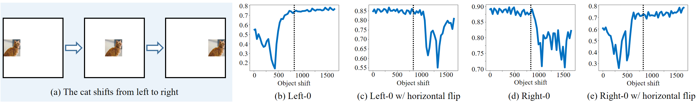
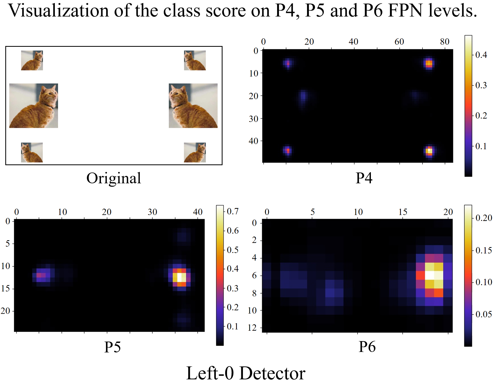

# Why does spatial equilibrium matter?

### The detector cannot perform uniformly across the zones.

### The detection performance is correlated with the object distribution.

When the object distribution satisfies the centralized photographer’s bias, the detector will favor more to the central zone, while losing the performance in most areas outside.

### This is not good for robust detection application.

If you have a fire dataset like this, the detector will be good at detecting fire in the central zone of the image. But for the zone near to the image border, uh huh, hope you are safe.

## Zone Evaluation

In order to capture the spatial bias, we need to quantify the detection performance in a specific zone of the image, rather than the full map.

### Zone Precision

Let’s start by the definition of evaluation zones. We define a rectangle region $R_i=\text{Rectangle}(p,q)=\text{Rectangle}((r_iW,r_iH),((1-r_i)W,(1-r_i)H))$ like this, 

where $r_i=i/2n$, $i\in$ { $0,1,\cdots,n$ }, $n$ is the number of zones.

Then, the evaluation zones are designed to be a series of annular zone $z^{i,j}=R_i\setminus R_j$, $i\textless j$.
We denote the range of the annular zone $z^{i,j}$ as $(r_i,r_j)$ for brevity.

We measure the detection performance for a specific zone $z^{i,j}$ by only considering the ground-truth objects and the detections whose centers lie in the zone $z^{i,j}$.
Then, for an arbitrary evaluation metric, for instance Average Precision (AP), the evaluation process stays the same to the conventional ways, yielding Zone Precision (ZP), denoted by $\text{ZP}^{i,j}$. Consider the default setting $n=5$, the evaluation zones look like this,

For implementation, please refer to [Zone evaluation](implementation.md).

#### With ZP, you can evaluate the object detectors in any way you want. It's up to you.

### Spatial Equilibrium Precision

Now that we have 5 ZPs, and they indeed provide more information about the detector's performance. We further present a **S**patial equilibrium **P**recision (SP), and we use this single value to characterize the detection performance for convenient usage.

$$\mathrm{SP}=\sum\limits_{i=0}^{n-1}\mathrm{Area}(z^{i,i+1})\mathrm{ZP}^{i,i+1}$$

where $\mathrm{Area}(z^{i,i+1})$ calculates the area of the zone $z^{i,i+1}$ in the normalized image space (square image with unit area 1). In general, SP is a weighted sum of the 5 ZPs, that is,
 
$$\mathrm{SP}=0.36\mathrm{ZP}^{0,1}+0.28\mathrm{ZP}^{1,2}+0.20\mathrm{ZP}^{2,3}+0.12\mathrm{ZP}^{3,4}+0.04\mathrm{ZP}^{4,5}$$

Our SP is based on the assumption similar to the traditional AP, i.e., the detector performs uniformly in the zone.
The difference is, our SP applies this assumption to a series of smaller zones, rather than the full map for traditional AP.
One can see that when $n=1$, our SP is identical to traditional AP as the term $\mathrm{Area}(z^{0,n})=1$, which means that the detectors are assumed to perform uniformly in the whole image zone.
As $n$ increases, the requirements for spatial equilibrium become stricter and stricter. And a large $n>5$ is also acceptable if a more rigorous spatial equilibrium is required.

### Variance of ZPs

As the detection performance varies across the zones, we further introduce an additional metric to gauge the discrete amplitude among the zone metrics.
Given all the ZPs, we calculate the variance of ZPs,

$$\sigma(\mathrm{ZP}) = \sum\limits_{i=0}^{n-1}(\mathrm{ZP}^{i,i+1}-\bar{\mathrm{ZP}})^2/n,$$

where $\bar{\mathrm{ZP}}$ is the mean value of ZPs.
Ideally, if $\sigma(\mathrm{ZP})=0$, the object detector reaches perfectly spatial equilibrium under the current zone division.
In this situation, an object can be well detected without being influenced by its spatial position.

## Something Interesting - A closer look at spatial bias

Some of you may have heard that if the dataset has few objects in a zone, the detector may perform poorly in that zone.
The question is even if we admit that, how do we discover it? Is there any quantitive evidence? **ZP is made for this**.

Here, we create a simple yet heuristic experiment by manually reducing the object supervision signals in a certain zone.
In this way, we can simulate the scene with few objects in a zone.

We first evenly divide the full map into two (left and right) halves.
Then, there are four pipeline settings for comparison: 

:one: `"left-0" detector: we train the network by discarding all the objects whose centers lie in the left zone of the image`.

2️⃣ `"right-0" detector: analogous to "left-0" detector by discarding the right zone objects`.

3️⃣ `"left-1" detector: we only assign 1 positive location for every left zone object`.
 
4️⃣ `"right-1" detector: the opposite settings to "left-1"`.

All the four detectors differ only in sampling process.
During training, horizontal flip with a probability of 0.5 is used to ensure that both left and right objects participate in the model training.
The evaluation is conducted on the left zone, the right zone and the full map separately, denoted by ZP@left, ZP@right, and ZP@full.

| Detector | Test time Horizontal Flip | ZP@left | ZP@right | ZP@full |
|:----------:|:----------:|:----------:|:----------:|:----------:|
| Left-0 | | 28.9 | 42.0 | 40.9 |
| Left-0 | :heavy_check_mark: | 42.3 | 28.8 | 40.8 |
| Left-1 | | 42.8 | 44.5 | 49.3 |
| Left-1 | :heavy_check_mark: | 45.0 | 41.7 | 49.5 |
| |
| Right-0 | | 42.8 | 27.2 | 40.5 |
| Right-0 | :heavy_check_mark: | 27.6 | 42.3 | 40.6 |
| Right-1 | | 45.7 | 41.0 | 49.2 |
| Right-1 | :heavy_check_mark: | 42.0 | 45.3 | 49.0 |

Note: The experiments are conducted on GFocal ResNet-18 with PASCAL VOC 07+12 training and testing protocol.

#### Imbalanced sampling of training samples causes severe spatial disequilibrium.

It can be seen that the detection performance of the "left-0" detector in the left zone is very poor, only 28.9 ZP@left, which lags behind ZP@right by 13.1. It is surprising that the detector cannot uniformly perform across the zones. If we adopt the horizontal flip during testing, it will be completely reversed for the left zone and the right one. The same observation can be seen from the "right-0" detector. This implies that the detection performance heavily depends on the positions of objects.
And the detector is good at detecting objects in the favor zone, simply because it receives much more supervision signals and therefore be endowed much better detection ability during training.

We also visualize the detection quality as below, where the cat shifts from left to right.
It can be seen that the detection quality will significantly drop when the cat is not at the favor zone.
If we flip the cat to the favor zone, the detection quality backs to normal immediately.

You see, even for the same object and the background is pure white, the detection quality still changes dramatically.
This is actually a little bit counter-intuitive, because the learning unit of the neural network is the convolution kernel, and it always slides over the entire image.
However, if the frequency of the supervision signal is imbalanced over the spatial zone, the learning of the convolution kernel is ultimately affected.
And it forms a zone-oriented convolution kernel, just like the case above, left zone favored or right zone favored.

As shown, one can see that the "left-0" detector produces very weak classification responses for the cats in the disfavor zone.
The left-0 detector fails to detect these cats since they seem to disappear in the left zone.
Such spatial bias has a great impact on the robustness of detection applications.

#### Traditional metrics fail to capture spatial bias.

One can see that the "left-0" detector produces a 40.9 ZP@full (traditional AP), which is unable to provide a reference for where and how much the performance drops.
Our zone metrics provide more meaningful information about the detection performance.

#### Increasing training samples for the disfavor zone shrinks the performance gap between zones.

The Table above also shows us promising results that the performance gap between the two zones can be significantly shrunk by simply increasing positive samples for the disfavor zones.
And it should be noted that the performance gap still exists as the sampling remains imbalanced.

## Correlation with Object Distribution

You may wonder how would the performance be if we define a finer zone division, for instance, $11\times 11$ zones, just like for counting the center points of all the ground-truth boxes.

Here, we evaluate the detection performance in the 121 zones one by one.
To quantitatively investigate the correlation between the zone metrics and the object distribution, we calculate the Pearson Correlation Coefficient (PCC) and the Spearman Correlation Coefficient (SCC) between the mZP and the object distribution of the test set. (Note: mZP denotes mAP in the zone.)

As shown in picture, we get the following deep reflection about the spatial bias.

We first note that all the PCC $>0.3$, which indicates that the detection performance is moderately linear correlated with the object distribution.
As a reminder, the PCC only reflects the linear correlation of two given vectors, while it may fail when they are curvilinearly correlated.
The Spearman correlation reflects a higher ranking correlation between the mZP and the object distribution with all the SCC $>0.45$.
This illustrates that the detection performance has a similar trend to the object distribution.
Our SELA substantially reduces these correlations, indicating a lower correlation with the object distribution, which we will talk about later.

## Spatial Equilibrium Label Assignment (SELA)

As a preliminary attempt, SELA utilizes a prior spatial weight to re-balance the sampling process during model training.
We map the anchor point coordinate $(x^a, y^a)$ to a spatial weight $\alpha(x^a, y^a)$ by a spatial weighting function,

$$\alpha(x,y) = 2\max\left\lbrace||x-\frac{W}{2}||_1\frac{1}{W}, ||y-\frac{H}{2}||_1\frac{1}{H}\right\rbrace,$$

Obviously, the spatial weight has the following properties:

(1) Non-negativity; (2) Bounded by $[0,1]$; (3) $\lim\limits_{(x,y)\rightarrow (\frac{W}{2},\frac{H}{2})}\alpha(x,y)=0$; and (4) When $p$ is located at the image border, $\lim\limits_{(x,y)\rightarrow p}\alpha(x,y)\rightarrow 1$.

The usage of spatial weight is multi-optional. We now provide two implementations. One is frequency-based approach, and another is cost-sensitive learning approach.

### SELA (frequency-based)

The frequency-based approach is straightforward. 
We know that the fixed label assignment strategy, e.g., the max-IoU assigner, is popular for years.
Given the positive IoU threshold $t$, the max-IoU assigner determines the positive samples by,

$$\textrm{IoU}(B^{a},B^{gt})\geqslant t,$$

where $B^{a}$ and $B^{gt}$ denote the preset anchor boxes and the ground-truth boxes.
In RetinaNet and RPN, $t=0.5$ is a constant.
In [ATSS](https://arxiv.org/abs/1912.02424), the assignment follows the same rule except the calculation of the IoU threshold.

Our SELA is simple that we just need to take one more factor into account, i.e., the spatial weight.

$$\textrm{IoU}(B^a,B^{gt})\geqslant t-\gamma\alpha(x^{a},y^{a}),$$

where $\gamma\geqslant 0$ is a hyper-parameter.
Now you see SELA relaxes the positive sample selection conditions for objects in the border zone.
Therefore, more anchor points will be selected as the positive samples for them.

### SELA (cost-sensitive learning)

We exploit the spatial weight to enlarge the loss weight for positive samples.
Let $\mathcal{L}$ be the loss function of a given positive anchor point $(x^a, y^a)$.
It calculates the classification loss and bbox regression loss.
Now we just need to re-weight this term by
$$\mathcal{L}=\mathcal{L}*(1+\gamma\alpha(x^{a},y^{a}))$$

The above two methods relieve the network from paying too much attention to the central objects. The following table is reported by VOC 07+12 protocol.

| Method | $\gamma$ | $\text{ZP}^{0,5}$ | $\text{ZP}^{0,1}$ | $\text{ZP}^{1,2}$ |  $\text{ZP}^{2,3}$ |  $\text{ZP}^{3,4}$ |  $\text{ZP}^{4,5}$ | Variance | SP |
|--------|----------|-------------|-------------|-------------|--------------|--------------|--------------|----------|----|
| GFocal |0    | 51.9 | 31.5 | 37.7 | 40.1 | 43.4 | 52.8 | 49.4 | 37.2 |
| SELA (frequency-based)|0.2  | 52.5 | 33.9 | 38.6 | 41.5 | 43.3 | 52.5 | 37.9 | 38.6 |
| SELA (cost-sensitive learning)| 0.1  | 52.1 | 33.2 | 38.7 | 40.8 | 43.2 | 53.0 | 46.7 | 38.3 |

The implementation can be seen in [SELA implementation](implementation.md#implementation-of-sela).
