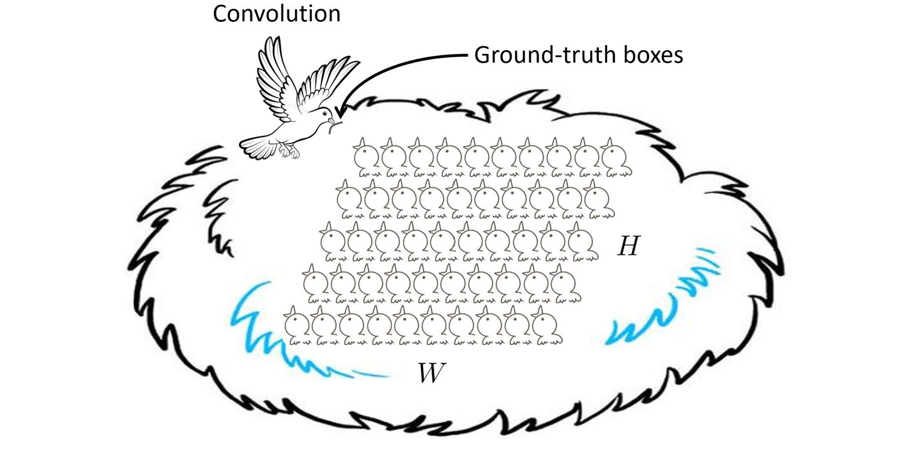
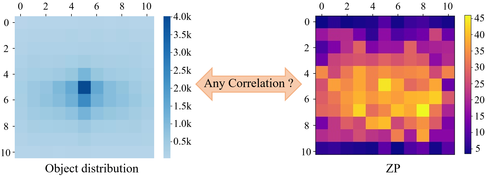

# 1. Prelude

If there are almost no cats in a certain image zone of the training set, will the detector also be bad at detecting cats in this zone?
<div align="center"></div>

For this question, there are two intuitive conjectures.

1. The detector did not show a clear "badness".
2. The detector is indeed not good at detecting cats in this zone.

So what is the real situation?

How does CNN memorize image data? Answer: By using convolutional kernels. The convolutional kernel slides over the entire image to calculate the feature map, and generates special activations when encountering positive samples. The detector classifies and locates these high-dimensional special activations to detect objects.

The two intuitions mentioned above have their reasonable guesses. 
For the first intuition, it mainly relies on the fact that CNN is not completely translation invariant.
A common belief is that CNN has translation invariance, that is, the model should output the same prediction result for an object no matter where it is. However, as a matter of fact, this property is incomplete. It does exist, but it is far from perfect.

<div align="center"></div>

The second intuition is that if a certain class of object almost appears in a zone, the special activation generated by CNN will also appear in this zone. Over time, the model also learns the absolute position, then the detector will be good at detecting this class of object in this zone. As discussed in the following paper, CNN can learn the absolute position of an object and use it as additional information to assist classification. 

[On Translation Invariance in CNNs: Convolutional Layers Can Exploit Absolute Spatial Location](https://openaccess.thecvf.com/content_CVPR_2020/html/Kayhan_On_Translation_Invariance_in_CNNs_Convolutional_Layers_Can_Exploit_Absolute_CVPR_2020_paper.html)

The pixels on the feature map are like nestlings waiting to be fed. They must be fed to become stronger. The convolution kernel seems to feed these nestlings one by one fairly, but in fact the number of bugs fed is different. Those nestlings that have plenty of bugs to eat will eventually grow into hawks, with hawk-like detection capabilities, significantly ahead of those that are hungry for a long time.

<div align="center"></div>

# 2. Spatial Bias

The spatial position of objects is the hidden information naturally contained in a dataset.
In fact, there is a lot of such hidden information, including the rotation angle of the object, the color saturation, the brightness, and even high-frequency/low-frequency information, etc.
All the image information you can see or think of is mixed, ultimately leading to the detection performance of today's object detector.

Differences in the number of objects between categories can cause classifiers to produce imbalanced classification accuracy.
Analogizing it to object detection, we have a reasonable guess: uneven distribution of objects in image spatial zone may also lead to disequilibrium in detection performance.

<div align="center"></div>

This is problematic for many real-world applications, e.g., fire/smoke detection, collision prevention in self-driving cars, and crowd counting and localization, where the border zone occupies a large proportion of the image area.

<div align="center"></div>

Now, even if there is a spatial bias in detection performance, how can we capture this?

**Quantify!**

Numerical quantification is an urgent first step. Does the detector have any spatial bias?
If so, how much? How can we make some improvements to make it spatially equilibrated?
All of this must be based on numerical quantification, otherwise, it makes no sense.

# 3. Zone Evaluation

If you want to measure the detection performance of a certain zone, just take out the detection boxes and objects whose centers fall into this zone, and exclude all the others whose centers are outside this zone. After that, evaluate as usual.

Let $S=\{z^1,z^2,\cdots, z^n\}$ be a zone partition s.t. $I=\bigcup\limits_S z^i$ and $z^i\cap z^j=\emptyset$, $\forall z^i,z^j\in S$, $z^i\neq z^j$.
We measure the detection performance for a specific zone $z^i$ by only considering the ground-truth objects and the detections whose centers lie in the zone $z^i$.
Then, for an arbitrary evaluation metric $m\in \mathcal{M}$, the evaluation process stays the same as the conventional ways, yielding $n$ zone metrics, each of which is denoted by $m^i$.
We call $m^S=\{m^1,m^2,\cdots, m^n\}$ the series of zone metrics for the zone partition $S$.


### Annular zone

In practice, the centralized photographer's bias is ubiquitous in visual datasets.
If one aims at a detector with comprehensive detection ability for all directions, the evaluation zones can be designed into a series of annular zones:

$z^{i,j}=R_i\setminus R_j$, $i\textless j$,

where $R_i=\text{Rectangle}(p,q)=\text{Rectangle}((r_iW,r_iH),((1-r_i)W,(1-r_i)H))$ denotes a centralized rectangle region like this,

<div align="center"></div>

$r_i=i/2n$, $i\in$ { $0,1,\cdots,n$ }, $n$ is the number of zones, and we denote the range of the annular zone $z^{i,j}$ as $(r_i,r_j)$ for brevity.

<div align="center"></div>

Then, for an arbitrary evaluation metric, for instance, Average Precision (AP), the evaluation process stays the same as the conventional way.
The AP obtained at this time is no longer AP in the traditional sense, and is called Zone Precision (ZP), denoted by $\text{ZP}^{i,j}$. Considering the default setting $n=5$, the evaluation zones look like this,

<div align="center"></div>

In this way, the traditional evaluation is a special case in our zone evaluation as one can easily get $\text{AP}=\text{ZP}^{0,n}$.

For implementation, please refer to [Zone evaluation](implementation.md).

### ZP Variance

As the detection performance varies across the zones, we further introduce an additional metric to gauge the discrete amplitude among the zone metrics.
Given all the zone metrics $m^S$ for a specific zone partition $S$, we calculate the variance

$$\sigma(m^S) = \sum\limits_{i=1}^{n}(m^i-\bar{m})^2/n,$$

where $\bar{m}$ is the mean value of zone metrics.
Ideally, if $\sigma(m^S)=0$, the generalization ability of the object detector reaches perfect spatial equilibrium **under the current zone partition**.
In this situation, an object can be well detected without being influenced by its spatial position.

### Spatial Bias and Spatial Equilibrium

spatial bias is an external manifestation of object detectors and also is a natural characteristic. There are three concepts as follows.

1) Let $S$ be a zone partition, the spatial equilibrium of the detector is good for $S$ if $\sigma(m^S)$ is sufficiently small.
2) Let $S_1,S_2$ be two different zone partitions with $n$ zones. If $\sigma(m^{S_1})<\sigma(m^{S_2})$, then the detector is considered to be more spatially equilibrated in the way of zone partition $S_1$.
3) The detector has no spatial bias, indicating $\forall S$ be a zone partition, $\sigma(m^S)$ is sufficiently small.

The ZP variance can only reflect the spatial equilibrium for the given zone partition.
From our later experiments, it can be seen that **"a detector has no spatial bias"** requires a very strict condition, which is usually impossible.
Spatial equilibrium does not require such strong conditions.
It only depends on a certain zone partition, which represents the measurement way that users care about.

## Zone Evaluation on Various Object Detectors

Next, we select various object detectors that have different detection pipelines but with the same level of traditional metrics.
They are popular, representative, and considered to be the milestones in modern object detection: one-stage dense detectors (RetinaNet, GFocal, VFNet, YOLOv5), multi-stage dense-to-sparse detectors (R-CNN series), and sparse detectors (DETR series and Sparse R-CNN).

<div align="center"></div>

There are several interesting observations:

1) **Spatial bias is quite common.** We can see that all the detectors show a clear centralized zone performance, i.e., performing well in the central zones ($z^{3,4}, z^{4,5}$) but unsatisfactorily in the border zones ($z^{0,1},z^{1,2}$). This confirms the existence and universality of spatial bias, and ZoneEval successfully quantifies this for the first time.
2) **Their spatial equilibria vary significantly.** There is a large gap of 12.9 to 26.9 in ZP variance. Particularly, we find that the sparse detectors, e.g., DETR series and Sparse R-CNN, tend to produce a large ZP variance, while the one-stage dense object detectors perform better in spatial equilibrium (lower ZP variance). Clearly, one can conclude that there must be some factors that lead to different spatial equilibria among detectors, including but not limited to the neural network architecture designs, optimization, and training strategies. Yet currently, we are unaware of which components or algorithm designs have an impact on spatial bias.
3) **Traditional evaluation fails to capture spatial bias.** It can be seen that GFocal (R-50) and DETR (R-50) achieve the same AP score of 40.1. However, the traditional metrics provide nothing about how much the detection performance is in a zone. ZoneEval shows that GFocal performs better in the border zones $z^{0,1}$ and $z^{1,2}$, while DETR performs better in the zones $z^{2,3}$, $z^{3,4}$, and $z^{4,5}$. And these performance discrepancies are concealed by the traditional evaluation.
4) It is interesting to see that the AP metrics are exactly between ZP$^{3,4}$ and ZP$^{4,5}$. The central zone ZP$^{4,5}$ only occupies 4% of the image area, which indicates that the detection performance in the remaining 96\% of the image area is actually lower than AP. Maybe the detectors are not as good as we imagined.

## Zone Evaluation on Various Detection Datasets

Now we provide the quantitative detection results on PASCAL VOC 07+12, MS COCO val2017, and 3 application datasets. We got a similar conclusion.

<div align="center"></div>

One should notice that there is also a representative case, i.e., the helmet dataset, having only 3.0 ZP variance.
This indicates that the helmet dataset achieves the best spatial equilibrium under the scenario of annular zone partition, whereas the other datasets have a clear spatial disequilibrium problem.
If we switch to other zone partitions, e.g., 5 zones along x-axis and 5 zones along y-axis, what would happen?

<div align="center"></div>

It can be seen that the face mask and helmet datasets increase ZP variance to 39.6 and 30.5 in the scenario of 5 zones along y-axis, respectively, while the fruit dataset decreases the ZP variance significantly in both cases.
The ZP variance is a set function related to zone partition.
The annular zone partition mainly considers the balance of detection ability between the inner zone and the outer one, which is a good choice in practice since the centralized photographer's bias is ubiquitous in visual datasets.
The zone partition is flexible and is able to be customized to any shape based on the application scenarios.

# Delving Deep into Spatial Bias

**Kindly see Section 4 of our paper.**

Currently, we exclude two intuitive conjectures for spatial bias.
We find that the spatial bias is less relevant to the object scale and the absolute positions of objects, but closely related to the gap of object data patterns between the zones.

# Something Interesting - A closer look at spatial bias

Some of you may have heard that if the dataset has few objects in a zone, the detector may perform poorly in that zone.
We now provide an intuitive case that exhibits the effect of the absolute positions of objects when the supervision signal strength goes extremely imbalanced.
Here, we create a simple yet heuristic experiment by manually reducing the object supervision signals in a certain zone.

We first evenly divide the full map into two (left and right) halves.
Then, there are four pipeline settings for comparison: 

:one: `"left-0" detector: we train the network by discarding all the objects whose centers lie in the left zone of the image`.

2️⃣ `"right-0" detector: analogous to "left-0" detector by discarding the right zone objects`.

3️⃣ `"left-1" detector: we only assign 1 positive location for every left zone object`.
 
4️⃣ `"right-1" detector: the opposite settings to "left-1"`.

All the four detectors differ only in sampling process.
During training, horizontal flip with a probability of 0.5 is used to ensure that both left and right objects participate in the model training.
The evaluation is conducted on the left zone, the right zone and the full map separately, denoted by ZP@left, ZP@right, and ZP@full.

| Detector | Test time Horizontal Flip | ZP@left | ZP@right | ZP@full |
|:----------:|:----------:|:----------:|:----------:|:----------:|
| Left-0 | | 28.9 | 42.0 | 40.9 |
| Left-0 | :heavy_check_mark: | 42.3 | 28.8 | 40.8 |
| Left-1 | | 42.8 | 44.5 | 49.3 |
| Left-1 | :heavy_check_mark: | 45.0 | 41.7 | 49.5 |
| |
| Right-0 | | 42.8 | 27.2 | 40.5 |
| Right-0 | :heavy_check_mark: | 27.6 | 42.3 | 40.6 |
| Right-1 | | 45.7 | 41.0 | 49.2 |
| Right-1 | :heavy_check_mark: | 42.0 | 45.3 | 49.0 |

Note: The experiments are conducted on GFocal ResNet-18 with PASCAL VOC 07+12 training and testing protocol.

#### Imbalanced sampling of training samples causes severe spatial disequilibrium.

It can be seen that the detection performance of the "left-0" detector in the left zone is very poor, only 28.9 ZP@left, which lags behind ZP@right by 13.1. It is surprising that the detector cannot uniformly perform across the zones. If we adopt the horizontal flip during testing, it will be completely reversed for the left zone and the right one. The same observation can be seen from the "right-0" detector. This implies that the detection performance heavily depends on the positions of objects.
And the detector is good at detecting objects in the favor zone, simply because it receives much more supervision signals and therefore be endowed much better detection ability during training.

We also visualize the detection quality as below, where the cat shifts from left to right.
It can be seen that the detection quality will significantly drop when the cat is not at the favor zone.
If we flip the cat to the favor zone, the detection quality backs to normal immediately.


You see, even for the same object and the background is pure white, the detection quality still changes dramatically.
This is actually a little bit counter-intuitive, because the learning unit of the neural network is the convolution kernel, and it always slides over the entire image.
However, if the frequency of the supervision signal is imbalanced over the spatial zone, the learning of the convolution kernel will be affected ultimately.
And it forms a zone-oriented convolution kernel, just like the case above, left zone favored or right zone favored.

<div align="center"></div>

As shown, one can see that the "left-0" detector produces very weak classification responses for the cats in the disfavor zone.
The left-0 detector fails to detect these cats since they seem to disappear in the left zone.
Such spatial bias has a great impact on the robustness of detection applications.

#### Traditional metrics fail to capture spatial bias.

One can see that the "left-0" detector produces a 40.9 ZP@full (traditional AP), which is unable to provide a reference for where and how much the performance drops.
Our zone metrics provide more meaningful information about the detection performance.

#### Increasing training samples for the disfavor zone shrinks the performance gap between zones.

The Table above also shows us promising results that the performance gap between the two zones can be significantly shrunk by simply increasing positive samples for the disfavor zones.
And it should be noted that the performance gap still exists as the sampling remains imbalanced.

# Spatial Disequilibrium Problem - a new research direction

### This is not good for robust detection applications, especially the safety ones.

If you have a fire dataset like this, the detector will be good at detecting fire in the central zone of the image. But for the zone near to the image border, uh huh, hope you are safe.

<div align="center"></div>
<div align="center"></div>

From the above results, we can see $\mathrm{ZP}^{0,1}, \mathrm{ZP}^{1,2},\mathrm{ZP}^{2,3},\mathrm{ZP}^{3,4}<\mathrm{AP}$, which indicates that the detectors are actually not as good as the AP reflects in 96% of image area.

## Problem Definition

Denoting $S$ be a zone partition, $m^S$ be a series of zone metrics, and $\sigma: R^n\rightarrow R$ be a variance calculation, the spatial disequilibrium problem is defined to minimize the variance of the zone metrics:

$$\underset{\Theta}{\min}\, \sigma(m^S|\Theta),$$

where $\Theta$ is the set of network parameters of the detector.
The general goal of facilitating spatial equilibrium is primarily decided by which zone partition to use, which is application-oriented.
Thus, for different application scenarios, the zone partition can be customized.

#### The spatial disequilibrium problem is formally equivalent to the class imbalance problem.

We denote the objects in the zone $z^i$ as $X^i_{obj}$.
The density of objects for a given zone $z^i$ can be represented as $d_i=|X^i_{obj}|/|z^i|$.
Intuitively, higher density indicates more positive samples, thereby generating a larger gradient flow on the zone.
It is analogous to the class imbalance problem which has a long-tail distribution among the classes.

<div align="center"></div>

Specifically, the classification branch predicts the class scores which is a $C\times H\times W$ tensor.
The density of the $c$-th class is represented as the ratio $d_i=|X_c|/(H\times W)$, $X_c$ is the object of the $c$-th class.
Since $H\times W$ is a constant, it is equivalent that all the samples of a class are placed in a zone with an identical area.
Then, each class has a single $H\times W$ zone for model learning and is disjoint among classes.

<div align="center"></div>

The above figure shows that both problems are subject to a long-tail distribution.
Due to that fact, the zone performance may also be correlated to the supervision signal strength in the zone.
A simple approach is to enlarge or reduce the supervision signal strength for the zones so that the network reaches a new convergence state.
Here we plug a new parameter $\beta$ into the label assignment algorithm.
An anchor is assigned to be a positive sample if its IoU is larger than $\alpha_p + \beta * 1_z$, where $\alpha_p$ is the positive IoU threshold, $1_z$ is 1 if the central point of this anchor lies in the zone $z$ and 0 otherwise.
Thus, the number of the positive samples $|X^i_p|$ decreases when $\beta$ increases.

<div align="center"></div>

We visualize the relative ZP above, where all the ZPs are subtracted by $\mathrm{ZP}^{0,1}$.
One can see that the centralized spatial bias can be further aggravated if we weaken the supervision signals by reducing the number of positive samples in the border zone.
Reversely, we can even achieve an anti-centralized spatial bias if we weaken the supervision signals in the central zone.
This indicates that the supervision signal strength does have an impact on the zone performance.

## Spatial Equilibrium Learning

Most existing research on object detection focuses on pursuing higher detection performance at the image level while neglecting optimization at the zone level, resulting in serious spatial disequilibrium issues for detectors.
We introduce a possible solution, termed Spatial Equilibrium Learning as the beginning of relieving the spatial disequilibrium problem.

We first introduce the spatial weight.
We map the anchor point coordinate $(x^a, y^a)$ to a spatial weight $\alpha(x^a, y^a)$ by a spatial weighting function,

$$\alpha(x,y) = 2\max\left\lbrace||x-\frac{W}{2}||_1\frac{1}{W}, ||y-\frac{H}{2}||_1\frac{1}{H}\right\rbrace,$$

<div align="center"></div>

Obviously, the spatial weight has the following properties:

(1) Non-negativity; (2) Bounded by $[0,1]$; (3) $\lim\limits_{(x,y)\rightarrow (\frac{W}{2},\frac{H}{2})}\alpha(x,y)=0$; and (4) When $p$ is located at the image border, $\lim\limits_{(x,y)\rightarrow p}\alpha(x,y)\rightarrow 1$.

The usage of spatial weight is multi-optional. We now provide two implementations. One is frequency-based approach, and the other is cost-sensitive learning approach.

### Spatial Equilibrium Label Assignment (SELA) (frequency-based approach)

The frequency-based approach is straightforward. 
We know that the fixed label assignment strategy, e.g., the max-IoU assigner, is popular for years.
Given the positive IoU threshold $t$, the max-IoU assigner determines the positive samples by,

$$\textrm{IoU}(B^{a},B^{gt})\geqslant t,$$

where $B^{a}$ and $B^{gt}$ denote the preset anchor boxes and the ground-truth boxes.
In RetinaNet and RPN, $t=0.5$ is a constant.
In [ATSS](https://arxiv.org/abs/1912.02424), the assignment follows the same rule except for the calculation of the IoU threshold.

Our SELA process is given by,

$$\textrm{IoU}(B^a,B^{gt})\geqslant t-\gamma\alpha(x^{a},y^{a}),$$

where $\gamma\geqslant 0$ is a hyper-parameter.
It can be seen that SELA relaxes the positive sample selection conditions for objects near the image borders.
Therefore, more anchor points will be selected as positive samples for them.
Notice that the above application is actually a frequency-based approach, just like many of the class rebalance sampling strategies proposed for the long-tail class imbalance problem.

### SELA (cost-sensitive learning)

We exploit the spatial weight to enlarge the loss weight for positive samples.
Let $\mathcal{L}$ be the loss function of a given positive anchor point $(x^a, y^a)$.
It calculates the classification loss and bbox regression loss.
Now we just need to re-weight this term by
$$\mathcal{L}=\mathcal{L}*(1+\gamma\alpha(x^{a},y^{a}))$$

The above two methods relieve the network from paying too much attention to the central zone. The following table is reported on VOC 07+12.

| Method | Network  | $\gamma$ | $\text{ZP}^{0,5}$ | Variance | $\text{ZP}^{0,1}$ | $\text{ZP}^{1,2}$ |  $\text{ZP}^{2,3}$ |  $\text{ZP}^{3,4}$ |  $\text{ZP}^{4,5}$ |
|----------|:--------:|:---------:|:-----------:|:-----------:|:-----------:|:------------:|:------------:|:------------:|:----------:|
| [GFocal](https://github.com/Zzh-tju/ZoneEval/blob/main/mmdetection/configs/sela/gfl_r18_fpn_1x_voc.py) [[GoogleDrive]](https://drive.google.com/file/d/1yHylgbfFcR4e9GE6BB4DK9JB6xulJ63i/view?usp=sharing) | R18 | 0 | 52.2 | 53.6 | 34.3 | 39.6 | 42.5 | 46.6 | 56.1 |
| [SELA (frequency-based)](https://github.com/Zzh-tju/ZoneEval/blob/main/mmdetection/configs/sela/gfl_sela_r18_fpn_1x_voc.py) [[GoogleDrive]](https://drive.google.com/file/d/1KyWeGEL1bVXVDqC2nAGK2hGYOTXMTGN_/view?usp=share_link) | R18  | 0.2 | 52.8 | 37.7 | 37.6 | 40.3 | 43.8 | 46.9 | 55.4 |
| [SELA (cost-sensitive learning)](https://github.com/Zzh-tju/ZoneEval/blob/main/mmdetection/configs/sela/gfl_sela_cost_sensitive_learning_r18_fpn_1x_voc.py) [[GoogleDrive]](https://drive.google.com/file/d/1xcovCvZ0c9DoV1Sg5gP8yCp3EJ1MYSLB/view?usp=sharing) | R18 | 0.1 | 52.5 | 41.6 | 37.2 | 40.6 | 42.9 | 46.5 | 56.0 |

Note:

 - For cost-sensitive learning approach on VOC 07+12, we find that it would be better to apply the spatial weighting function on classification loss and bbox regression loss on the positive locations, while it would be better to apply on full map for classification loss on COCO.
 
 If you train SELA (cost-sensitive learning) on COCO, you enable the second.
 
 ```python
        if self.gamma is not None:
            # cost sensitive learning SELA
            #label_weights = label_weights[pos_inds] * (spatial_weights[pos_inds] * self.gamma + 1)  # for VOC 07+12
            label_weights = label_weights * (spatial_weights * self.gamma + 1)  # for COCO
 ```
The implementation can be seen in [SELA implementation](implementation.md#implementation-of-sela).

### Visualization 

Visualizations of detection results for GFocal (first row) and GFocal + SELA (second row). Our method boosts the detection performance for the border zone.
Our method can significantly improve the detection performance of the border zone.
We believe that further exploration of spatial equilibrium is clearly worthy and important for future robust detection applications.

<div align="center"></div>

### Correlation with Object Distribution

You may wonder how would the performance be if we define a finer zone division, for instance, $11\times 11$ zones, just like for counting the center points of all the ground-truth boxes, i.e., the object distribution.

<div align="center"></div>

Here, we evaluate the detection performance in the 121 zones one by one.
To quantitatively investigate the correlation between the zone metrics and the object distribution, we calculate the Pearson Correlation Coefficient (PCC) and the Spearman Correlation Coefficient (SCC) between the mZP and the object distribution of the test set. (Note: mZP denotes mAP in the zone.)

<div align="center"></div>

As shown in picture, we get the following deep reflection about the spatial bias.

We first note that all the PCC $>0.3$, which indicates that the detection performance is moderately linear correlated with the object distribution.
As a reminder, the PCC only reflects the linear correlation of two given vectors, while it may fail when they are curvilinearly correlated.
The Spearman correlation reflects a higher ranking correlation between the mZP and the object distribution with all the SCC $>0.45$.
This illustrates that the detection performance has a similar trend to the object distribution.
Our SELA substantially reduces these correlations, indicating a lower correlation with the object distribution.

# Significance, Challenges and Outlook

### Significance

Spatial bias is a natural obstacle in object detection that the detectors usually show a performance drop in the border zone, which occupies a large proportion of the image area.
While the classic AP metric is still considered to be the primary measurement, it is difficult to reveal spatial bias and is challenging to comprehensively reflect the real performance of object detectors.
Maximizing the AP metric does not fully indicate a robust detection and performs well in all zones.
Zone evaluation supplements a series of zone metrics, compensates for the drawbacks of traditional evaluation, and captures more information about detection performance.
We hope this work could inspire the community to rethink the evaluation of object detectors and stimulate further explorations on spatial bias, and the solutions to the spatial disequilibrium problem.

### Challenges

There are several challenges left behind in this work:

1️⃣ **Interpretability of spatial bias in various object detectors.** This work mainly reveals the existence and the discrete amplitude of spatial bias in object detectors, whereas the specific reason why different detectors perform quite differently is still frozen in the ice. The neural network architecture designs, pre-training data, optimization, training strategies, and even hyper-parameters may play a role in the spatial bias. Further exploration to answer the above question is of paramount importance.

2️⃣ **The effect of other potential factors on the spatial bias.** Currently, we pinpointed an evident correlation between imbalanced object distribution and zone performance. There are some complicated yet implicit factors such as image blur, object occlusion, border effect, noise, etc., that may also contribute to spatial bias. However, current detection datasets almost lack such annotations for the above factors, making it difficult to establish a quantitative analysis.

3️⃣ **Zone evaluation for other vision tasks.** Researchers have found some clues that the image generator may generate distorted content near the image border. Hence, the spatial bias may also exist in many vision tasks. Our zone evaluation may have great potential to reveal spatial bias, whether for high-level or low-level vision tasks.
